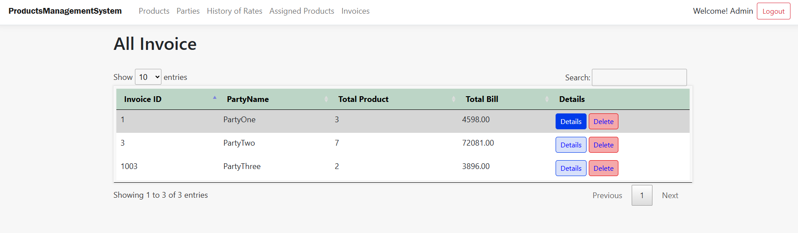
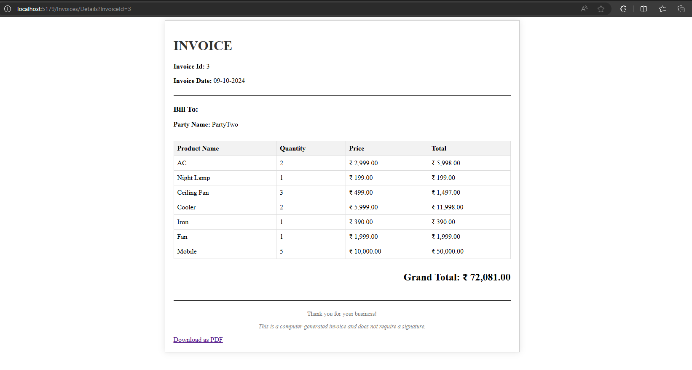

# Product Management System

## Table of Contents
- [Overview](#overview)
- [Tech Stack](#tech-stack)
- [Entities](#entities)
- [Features](#features)
- [Getting Started](#getting-started)
- [Screenshots](#screenshots)
- [License](#license)

## Overview
The **Product Management System** is a web-based application that helps manage parties, products, product rates, and invoices. It allows businesses to assign products to parties, update rates, generate invoices, and manage records efficiently. The system also provides functionalities like sorting, searching, and downloading invoices as PDFs.

## Tech Stack
- **Framework**: .NET Core MVC
- **ORM**: Entity Framework Core (Code First)
- **Authentication**: Identity Framework
- **Database**: SQL Server

## Entities
- **Party**: Represents a business or individual party in the system.
- **Product**: Represents a product available for sale.
- **ProductRate**: Tracks the rate of products, including changes over time.
- **Invoice**: Represents an invoice for a party with selected products and quantities at the latest rates.

## Features
### Parties Management
- View, update, and delete parties from the system.
  
### Products Management
- View, update, and delete products.

### Product Assignment to Parties
- Assign or update products for specific parties.

### Product Rates Management
- Update product rates and track changes over time.

### Invoice Management
- Create or update invoices.
- Automatically calculate the total invoice amount based on the selected products and quantities.

### Invoice Listing
- List all invoices for a particular party.
- Search invoices based on products and dates.
- Sort invoices by date or product.

### Grids Pages
- Search and sort functionalities for party, product, and invoice listings.

### Additional Features
- **PDF Export**: Download invoices as PDFs.
- **Delete Invoice**: Delete an invoice from the system.

## Getting Started
### Prerequisites
- .NET Core SDK (Version 6 or later)
- SQL Server
- Visual Studio 2022 or later

### Setup Instructions
1. **Clone the repository**:
    ```bash
    git clone https://github.com/altracc/product-management-system.git
    ```

2. **Navigate to the project directory**:
    ```bash
    cd product-management-system
    ```

3. **Restore NuGet packages**:
    ```bash
    dotnet restore
    ```

4. **Apply migrations and update the database**:
    ```bash
    dotnet ef database update
    ```

5. **Run the application**:
    ```bash
    dotnet run
    ```

### Configuration
- Update the connection string in `appsettings.json` to match your SQL Server setup.

## Screenshots

### Parties Management


### Invoice Listing


## License
This project is licensed under the MIT License - see the [LICENSE](LICENSE) file for details.
